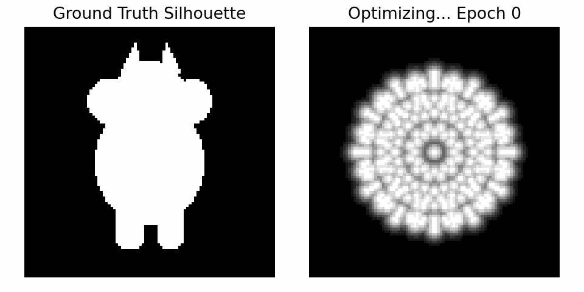
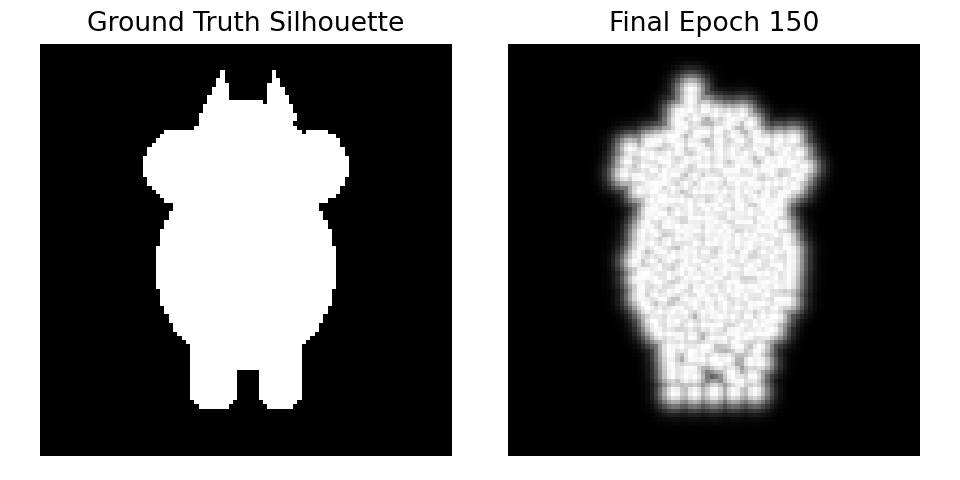
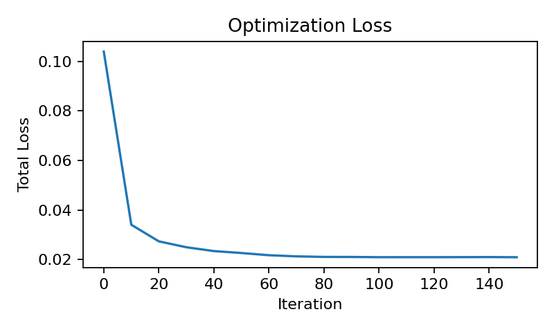

# 基于软光栅化的球体到牛形轮廓可微优化实验报告

## 一、实验目标

本实验基于软光栅化思想，实现一个从初始球体网格到目标牛形轮廓的可微优化过程。实验将网格顶点偏移量设置为可优化参数，通过轮廓损失和网格正则项共同约束模型形变，使球体轮廓逐步接近目标牛形轮廓。

本实验主要目标如下：

1. 理解软光栅化的基本原理，掌握其在轮廓匹配任务中的作用。
2. 掌握三维网格顶点坐标可优化的基本方法。
3. 理解拉普拉斯平滑、边长一致性和法线一致性在网格优化中的作用。
4. 完成优化过程可视化、最终结果对比图和 Loss 曲线输出。

---

## 二、实验环境

| 项目 | 内容 |
| --- | --- |
| 操作系统 | Windows |
| IDE | Trae |
| 环境管理 | uv + .venv |
| Python 版本 | Python 3.11 |
| 主要依赖 | torch、numpy、pillow、matplotlib、tqdm、imageio |

---

## 三、实验原理

### 3.1 软光栅化原理

传统光栅化通常使用离散判断确定像素是否位于三角形内部，该过程不利于梯度反向传播。为了解决这一问题，本实验采用软光栅化方法，将像素到三角形边界的距离转化为连续的透明度概率。

对于像素点到三角形边界的有符号距离 `d`，使用 Sigmoid 函数计算其轮廓概率：

```text
A(d) = sigmoid(d / σ)
```

其中，`σ` 用于控制轮廓边缘的平滑程度。通过这种方式，渲染过程由离散判断转化为连续可导计算，使网格顶点能够根据轮廓误差进行优化。

### 3.2 轮廓匹配损失

实验将当前网格渲染得到的轮廓图与目标牛形轮廓图进行比较，使用均方误差作为主要损失：

```text
L_silhouette = MSE(pred_silhouette, target_silhouette)
```

其中，`pred_silhouette` 表示当前网格渲染得到的轮廓图，`target_silhouette` 表示目标牛形轮廓图。

### 3.3 网格正则化

仅依赖轮廓损失优化顶点时，网格容易出现局部扭曲、塌陷或尖刺。为保持网格形状稳定，本实验加入三类正则项：

1. **拉普拉斯平滑**：约束相邻顶点的偏移差异，防止局部突变。
2. **边长一致性**：约束优化前后边长变化，防止三角形过度拉伸或压缩。
3. **法线一致性**：约束相邻三角面的法向量方向，保持表面平滑。

最终总损失函数为：

```text
L_total = L_silhouette + w_lap L_lap + w_edge L_edge + w_normal L_normal
```

其中，轮廓损失负责推动模型接近目标形状，正则项负责维持网格结构的稳定性。

---

## 四、项目结构

本项目采用 `src` 结构组织代码，整体结构如下：

```text
soft-cow-rasterization/
├─ assets/
│  └─ cow.obj 或 target.png
├─ outputs/
│  ├─ final_comparison.png
│  ├─ optim.gif
│  ├─ loss_curve.png
│  ├─ loss_log.csv
│  └─ frame_*.png
├─ src/
│  └─ soft_cow_rasterization/
│     ├─ __init__.py
│     └─ main.py
├─ pyproject.toml
├─ uv.lock
├─ .gitignore
└─ README.md
```

### 4.1 `src` 目录说明

```text
src/
└─ soft_cow_rasterization/
   ├─ __init__.py
   └─ main.py
```

`main.py` 是本实验的核心代码文件，主要包含以下模块：

| 模块 | 功能说明 |
| --- | --- |
| 网格生成模块 | 生成初始球体网格，作为待优化模型 |
| 目标轮廓模块 | 加载或生成目标牛形轮廓图 |
| 软光栅化模块 | 将三维网格投影并渲染为二维软轮廓图 |
| 损失计算模块 | 计算轮廓误差和网格正则化损失 |
| 优化模块 | 使用 Adam 优化器更新顶点偏移量 |
| 输出模块 | 保存优化过程图、最终结果图、GIF 和 Loss 曲线 |

---

## 五、实验内容与实现过程

### 5.1 构建初始球体网格

实验首先生成一个球体网格作为源模型。该网格由顶点和三角面片组成，后续优化过程中不直接改变原始顶点，而是引入顶点偏移量 `deform` 作为可优化参数。

优化后的顶点表示为：

```text
verts = base_verts + deform
```

其中，`base_verts` 为初始球体顶点，`deform` 为待优化的顶点偏移量。

### 5.2 生成目标牛形轮廓

实验目标是让球体轮廓逐渐接近牛形轮廓。程序支持两种目标来源：

1. 若 `assets` 目录下存在 `cow.obj` 或 `target.png`，则读取该文件作为目标。
2. 若没有提供外部目标文件，则自动生成一个牛形二维轮廓作为参考图。

本实验采用程序自动生成的牛形轮廓作为目标轮廓。

### 5.3 软轮廓渲染

在每次优化迭代中，程序将当前三维网格投影到二维平面，并通过软光栅化方法得到当前轮廓图。由于软光栅化过程具有连续性，因此轮廓误差可以反向传播到顶点偏移量。

### 5.4 损失函数设计

本实验的损失函数由轮廓损失和网格正则损失组成：

1. 轮廓损失：约束当前轮廓接近目标轮廓。
2. 拉普拉斯平滑损失：约束相邻顶点变化平滑。
3. 边长一致性损失：避免边长发生过大变化。
4. 法线一致性损失：保持相邻面的法线方向一致。

这种设计既能推动模型向目标轮廓变形，又能减少网格畸变。

### 5.5 优化过程

实验使用 Adam 优化器更新顶点偏移量。每轮迭代的基本流程如下：

```text
生成当前顶点位置
        ↓
软光栅化得到当前轮廓图
        ↓
计算轮廓损失和正则损失
        ↓
反向传播计算梯度
        ↓
Adam 优化器更新顶点偏移
        ↓
保存关键帧和 Loss 数据
```

---

## 六、实验结果

### 6.1 优化过程动态图

下图展示了球体轮廓逐步向牛形轮廓优化的过程。



从优化过程可以看出，初始球体轮廓在迭代过程中逐渐发生形变，整体轮廓逐步接近目标牛形轮廓。

### 6.2 最终轮廓对比图

下图为目标牛形轮廓与最终优化结果的对比。



左侧为目标轮廓，右侧为优化后的轮廓结果。可以看出，优化后的形状已经具备牛形轮廓的主要特征，说明软光栅化能够有效引导网格顶点进行形状优化。

### 6.3 Loss 曲线

下图展示了优化过程中总损失的变化情况。



从 Loss 曲线可以看出，随着迭代次数增加，损失整体呈下降趋势，说明优化过程有效，模型轮廓逐步接近目标轮廓。

---

## 七、输出文件说明

实验运行后，`outputs` 目录中生成以下文件：

| 文件 | 说明 |
| --- | --- |
| `final_comparison.png` | 目标轮廓与最终优化结果对比图 |
| `optim.gif` | 优化过程动态图 |
| `loss_curve.png` | 损失函数变化曲线 |
| `loss_log.csv` | 优化过程中的 Loss 数值记录 |
| `frame_*.png` | 优化过程中保存的关键帧图像 |

---

## 八、实验结果分析

本实验成功实现了球体网格到牛形轮廓的可微优化过程。实验结果表明，软光栅化可以将轮廓渲染过程转化为可导计算，使渲染图像中的误差能够反向传播到三维网格顶点。

在优化过程中，轮廓损失主要负责引导球体向目标形状靠近；拉普拉斯平滑、边长一致性和法线一致性则用于约束网格形变，减少局部塌陷和不规则变形。最终结果能够较好地接近目标牛形轮廓，说明实验方法有效。

同时，实验结果中仍存在一定边缘模糊和局部噪声。这主要与软光栅化分辨率、迭代次数、目标轮廓复杂度和正则项权重有关。若进一步增加迭代次数、提高图像分辨率或调整正则权重，优化结果仍有继续改进的空间。

---

## 九、实验总结

本实验围绕软光栅化与可微优化展开，实现了从球体网格到目标牛形轮廓的自动优化过程。实验通过设置顶点偏移量为可优化参数，将二维轮廓误差反向传播到三维网格顶点，从而完成模型形状更新。

通过本实验，可以直观理解可微渲染的基本思想：渲染结果参与损失计算，损失通过反向传播影响三维模型参数。同时，本实验也说明，在网格优化任务中，合理的正则化约束对于保持模型稳定性和表面平滑性具有重要作用。

---

## 十、参考资料

1. PyTorch 官方文档
2. uv 官方文档
3. 课程 PPT 中关于软光栅化和网格正则化的相关内容
4. Soft Rasterizer 与 Differentiable Rendering 相关资料